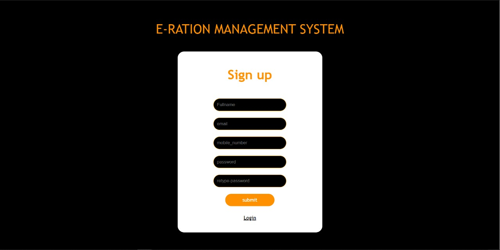
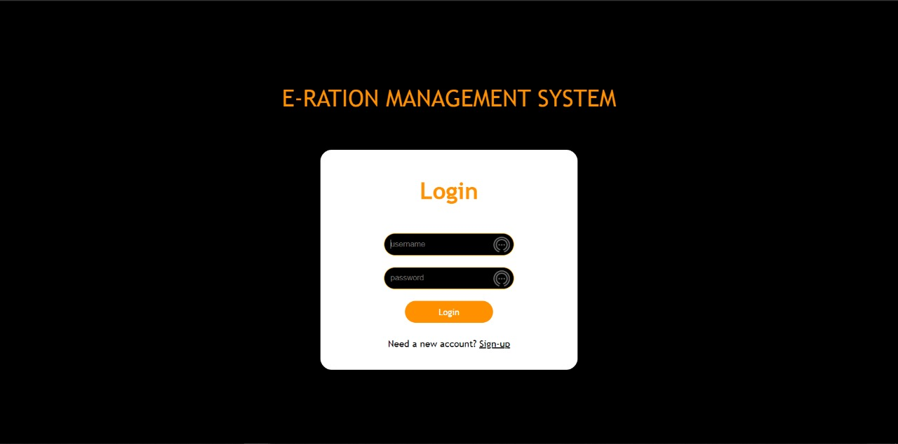
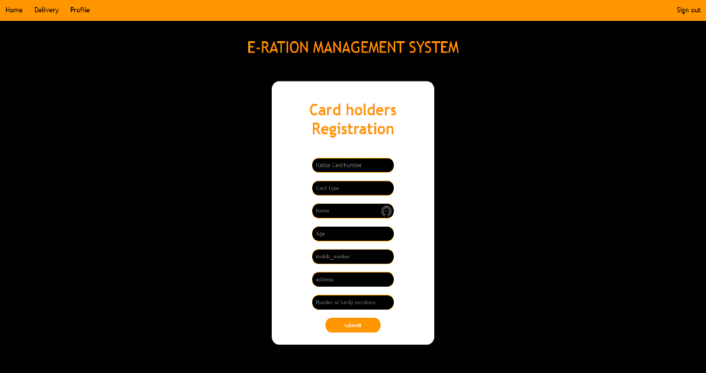
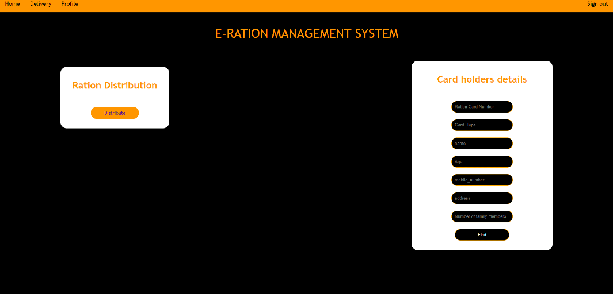
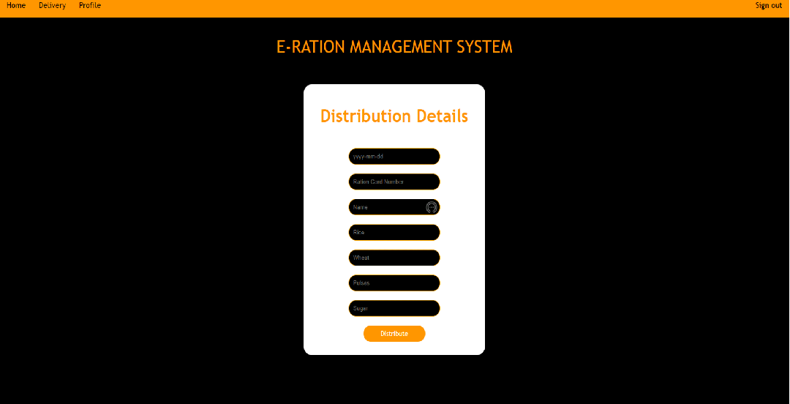
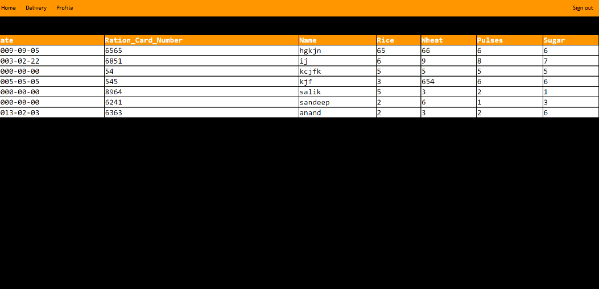
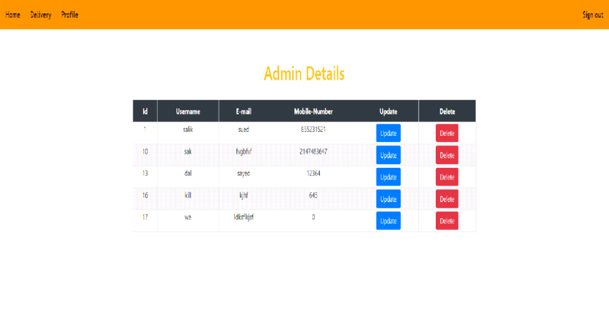

# E-Ration-Management-System__Mini-Project

Technologies :  HTML, CSS, Bootstrap, PHP, MYSQL.

The Web Application is designed to Computerize the Ration Supply to public people where each individual will have a Ration Card whose data will be stored in a Database while distributing ration items to the Customer,so that the stored data can be used in future while Distributing ration ,which in turn Reduces the time of Manually Entering cardholders data everytime. The Project aims at Providing a more Transparent and Efficient Ration Distribution. 
 

